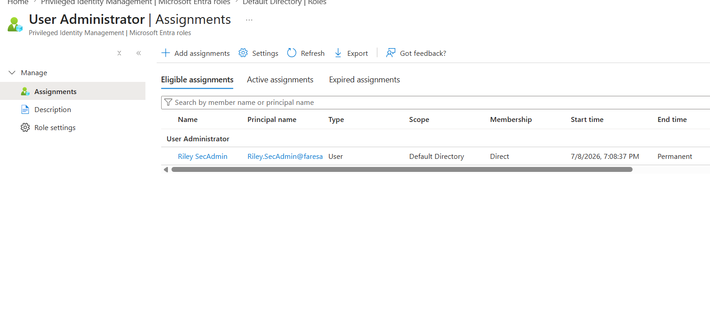
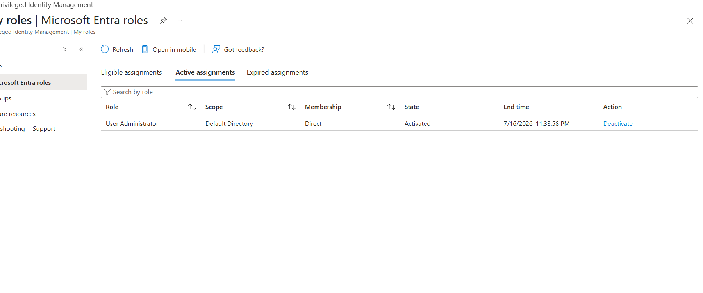
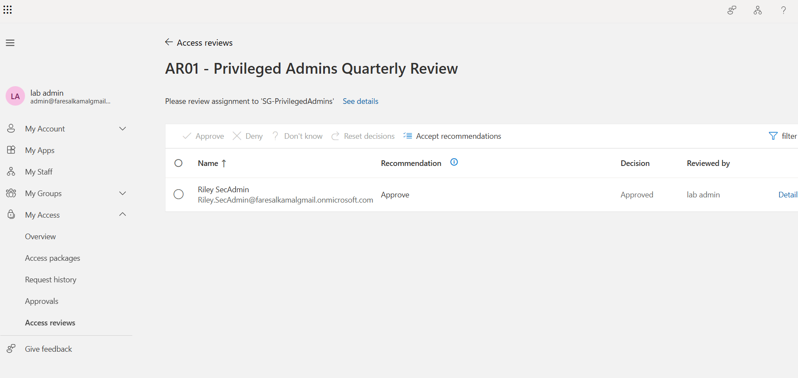

# Identity & Access Management / Zero Trust Lab — Microsoft Entra ID

[](https://entra.microsoft.com)
[]()
[](LICENSE)

A hands-on lab that builds a complete identity environment in Microsoft Entra ID and secures
it with Zero Trust controls: **MFA and Conditional Access**, **least privilege and RBAC**,
**just-in-time admin access via PIM**, and **identity lifecycle governance**.

Every control below was built, enforced, and **verified with live evidence** — not just
configured and screenshotted.

---

## The question this lab answers

> **If an attacker steals a valid password from this tenant, how much do they actually get?**

| Attack step | Control that stops it |
|---|---|
| Use the stolen password | MFA required — `CA01` |
| Bypass MFA via legacy protocols | Legacy auth blocked — `CA03` |
| Sign in from anywhere | Location-aware MFA — `CA04` |
| Use leaked / sold credentials | Risk-based block — `CA05` |
| Land on an account that *is* admin | No standing admin — PIM eligible only |
| Keep the access | 2-hour cap, auto-expiry |
| Exploit access nobody remembers | Access reviews + lifecycle removal |

**Answer:** a standard user account, MFA-challenged, with zero administrative rights, subject
to periodic review. The credential alone is close to worthless.

---

## Proof it works

**Conditional Access enforcing MFA on a live sign-in** — request interrupted (`50055`), then
successful only after authentication:


**No standing admin** — the privileged role exists as an *eligibility*, and the
**Active assignments tab is empty at rest**:



**Just-in-time elevation** — activated with MFA + written justification, with an automatic
expiry timestamp:



**Governance** — privileged group reviewed, decision documented, auto-apply enforcing it:



---

## What was built

| Phase | Capability | Zero Trust pillar | Documentation |
|---|---|---|---|
| 0 | Tenant, licensing, break-glass admin | Foundation | [`01-lab-setup.md`](docs/01-lab-setup.md) |
| 1 | 6 identities, 4 security groups, protected app | Clean foundation | [`01-lab-setup.md`](docs/01-lab-setup.md) |
| 2 | 5 Conditional Access policies + MFA | **Verify explicitly** | [`02-mfa-conditional-access.md`](docs/02-mfa-conditional-access.md) |
| 3 | RBAC, least privilege, PIM just-in-time | **Least privilege** | [`03-least-privilege-rbac.md`](docs/03-least-privilege-rbac.md) |
| 4 | Access reviews + Joiner-Mover-Leaver | **Assume breach** | [`04-access-reviews-jml.md`](docs/04-access-reviews-jml.md) |
| 5 | Rationale, trade-offs, known gaps | Judgement | [**`05-design-decisions.md`**](docs/05-design-decisions.md) ⭐ |

**Deliverables:** [RBAC matrix](deliverables/rbac-matrix.md) ·
[JML runbook](deliverables/jml-runbook.md) ·
[Conditional Access policy set](deliverables/conditional-access-policies.md)

> ⭐ **Start with [`05-design-decisions.md`](docs/05-design-decisions.md)** — it covers the
> reasoning, the trade-offs, the mistakes I made and corrected, and an honest list of the
> gaps in this build.

---

## Architecture

```
                        ┌──────────────────────────────┐
                        │       Entra ID Tenant        │
  Admin ──── manages ──▶│  Users ─▶ Groups ─▶ Apps     │
                        └───────────────┬──────────────┘
                                        │
      Sign-in ──▶ [ MFA ] ──▶ [ Conditional Access ] ──▶ ALLOW / BLOCK
                                        │
                  signals: role · location · client · risk
                                        │
                        [ RBAC — access via groups ]
                                        │
              [ PIM — eligible, not active · MFA · 2h · auto-expiry ]
                                        │
              [ Access Reviews ]  +  [ Joiner · Mover · Leaver ]
```

---

## Conditional Access policy set

All policies built **report-only first**, with the break-glass account **excluded from every
one** — a misconfigured policy should cost a log entry, not tenant lockout.

| Policy | Target | Condition | Control |
|---|---|---|---|
| `CA01` | All users | Any sign-in | Require MFA |
| `CA02` | Directory roles (3) | Any sign-in | Require MFA |
| `CA03` | All users | Legacy auth clients | **Block** |
| `CA04` | All users | Outside trusted location | Require MFA |
| `CA05` | All users | Sign-in risk High + Medium | **Block** |

---

## Privileged access model

```
Riley.SecAdmin  ──  ELIGIBLE for User Administrator  (never Active at rest)
                          │
                     [ Activate ]
                          │
        MFA  +  written justification  +  ≤ 2 hours
                          │
                    ACTIVE — with expiry
                          │
                  auto-revoked, fully logged
```

**User Administrator, not Global Administrator** — least privilege means the least authority
that still completes the task, not just a smaller-sounding role.

---

## Skills demonstrated

`Microsoft Entra ID` · `Zero Trust Architecture` · `Conditional Access` · `MFA` ·
`RBAC` · `Least Privilege` · `Privileged Identity Management (PIM)` · `Access Reviews` ·
`Identity Lifecycle (JML)` · `Identity Governance` · `Security Documentation` ·
`Risk-Based Access Control`

**Roles this maps to:** IAM Analyst · GRC Analyst · Cybersecurity Analyst ·
Cloud Security Analyst · SOC Analyst

---

## Reproduce it

Full click-by-click build guide, including licensing prerequisites and the gotchas that cost
me time: [**`WALKTHROUGH.md`**](WALKTHROUGH.md)

**Licensing note:** Conditional Access requires Entra ID **P1**; PIM, Access Reviews, and
risk-based policies require **P2**. The P2 free trial (31 days, 100 licenses) unlocks
everything here at no cost.

---

## Honest scope

This is a **lab in a disposable tenant with test identities** — no production systems, no real
user data. Screenshots are redacted of tenant, object, and network identifiers.

It is deliberately **not** presented as production-grade. The known gaps — unmonitored
break-glass account, phishable MFA, no device compliance, no SIEM integration, manual
lifecycle — are enumerated with their fixes in
[`05-design-decisions.md`](docs/05-design-decisions.md). A lab that claims no weaknesses
hasn't been examined honestly.
