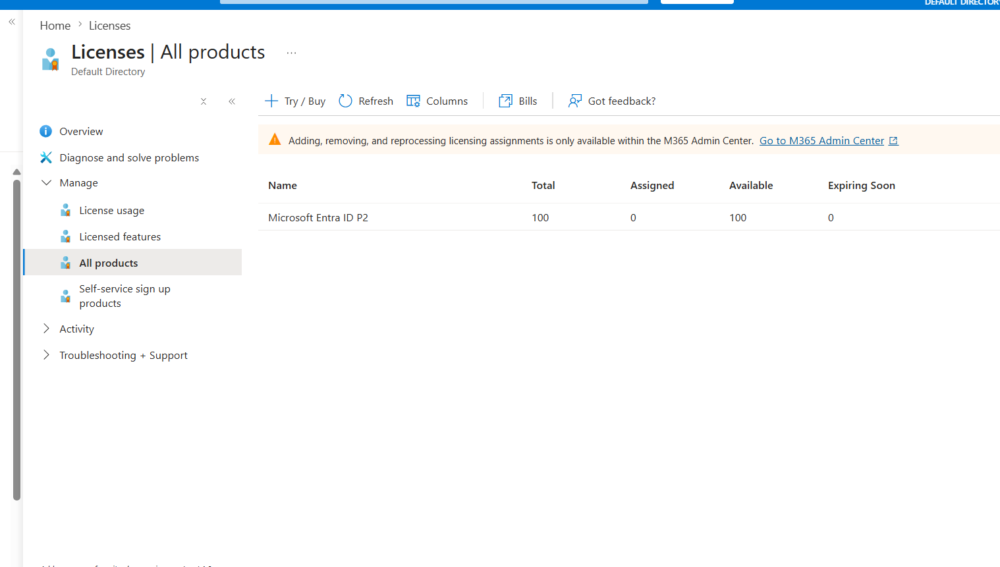
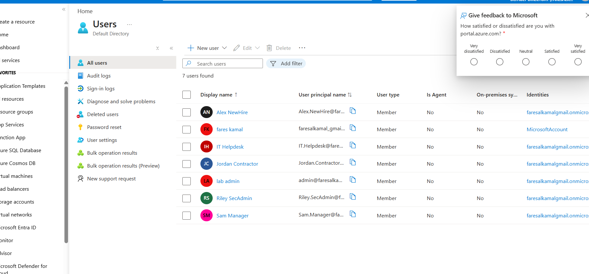
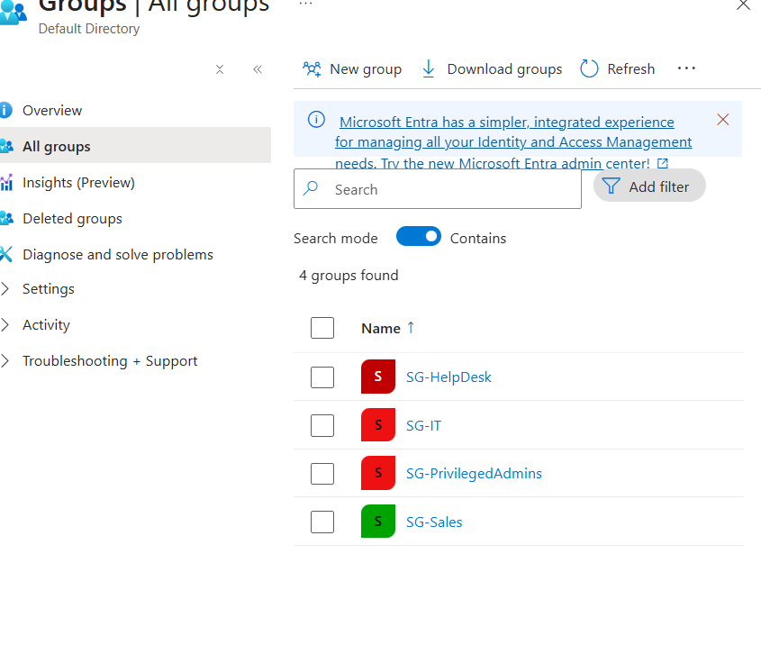
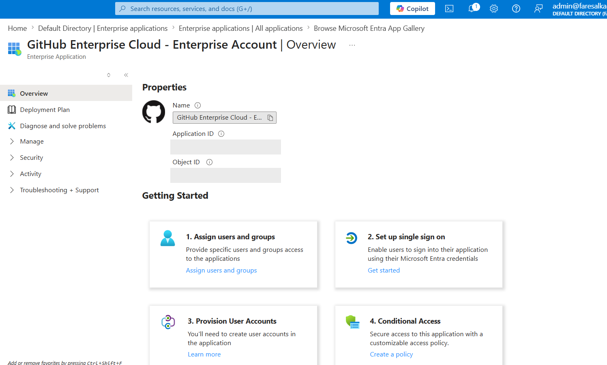
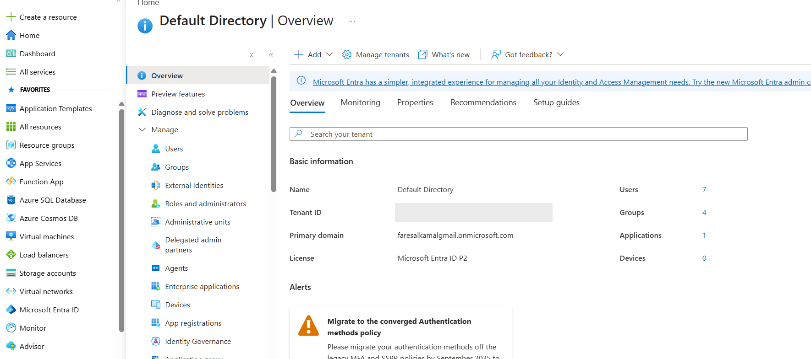

# 01 · Lab Setup & Identity Foundation

**Status:** ✅ Completed
**Zero Trust pillar:** Foundation
**License:** Entra ID Free → **P2 trial** (31 days, 100 licenses)

---

## Objective

Stand up a disposable Entra ID tenant under full administrative control, unlock the premium
features the rest of the lab depends on, and build a clean identity foundation that every
later control targets.

---

## Part 1 — Tenant and licensing

### Licensing requirements

Everything in this lab is gated by license tier. Knowing which tier unlocks what is half the
planning:

| Capability | Minimum license |
|---|---|
| Basic MFA / security defaults | Entra ID **Free** |
| **Conditional Access** | Entra ID **P1** |
| **PIM**, **Access Reviews**, **Identity Protection** (risk) | Entra ID **P2** |

The **P2 trial** (31 days, 100 licenses, $0) unlocks all of it at once — so the hands-on work
was planned as a focused sprint inside the trial window.

### The activation blocker — and its root cause

Activating the P2 trial while signed in with the personal account used to create the Azure
subscription **fails**. Microsoft rejects it and asks for a *"work or school"* email address.

**Root cause:** the trial is provisioned against a work/school identity, and a personal
account (`@gmail.com`, `@outlook.com`) doesn't qualify — even though it owns the subscription.

**Fix:** a cloud user in the tenant's own `.onmicrosoft.com` domain **is** a work/school
account. So:

1. Create `admin@<tenant>.onmicrosoft.com` inside the tenant.
2. Assign it **Global Administrator**.
3. Sign out, sign back in **as that user**.
4. `Billing → Licenses → Overview → Get a free trial → Entra ID P2 → Activate`.

Activation succeeds. This is the single most common wall people hit on this project.

> **Cost note:** the trial is $0. A payment method is required for **identity verification
> only** and is not charged. Prepaid/virtual cards are commonly rejected.

### Licensing model

A P2 license is consumed **per user**, and is only needed on accounts a premium feature must
*act on* — the PIM user and any user a Conditional Access policy evaluates. Directory users
who exist for realism don't need one.

**Assigned:** `lab admin` (runs PIM) and `Riley.SecAdmin` (subject of PIM) — 2 of 100.

---

## Part 2 — Identity foundation

### Identities

Six accounts, deliberately named so screenshots read like a real directory rather than a
sandbox of `test123`:

| Account | Purpose |
|---|---|
| `Alex.NewHire` | Standard employee — subject of the full JML lifecycle (Phase 4) |
| `Sam.Manager` | Team manager — used to verify MFA enforcement (Phase 2) |
| `Jordan.Contractor` | External / limited — tighter access model |
| `IT.Helpdesk` | Support role — password reset, deliberately no role-granting rights |
| `Riley.SecAdmin` | Security admin — made PIM-eligible (Phase 3) |
| `lab admin` | Break-glass / emergency access |

**No roles assigned at creation.** Nobody receives administrative rights simply for existing —
privilege is granted later, deliberately, and only as a PIM eligibility.

### Groups

Four security groups, prefixed `SG-` for readability:

| Group | Members | Notes |
|---|---|---|
| `SG-Sales` | Sam.Manager, Alex.NewHire | Baseline department access |
| `SG-IT` | IT.Helpdesk | Department access |
| `SG-HelpDesk` | IT.Helpdesk | Function-based access |
| `SG-PrivilegedAdmins` | Riley.SecAdmin | ⚠️ **role-assignable = Yes** |

> ⚠️ **Set-once setting.** *"Microsoft Entra roles can be assigned to the group"* can **only**
> be enabled at creation and is permanently locked afterwards. It's required for a group to
> hold a directory role via PIM. Miss it and the group must be deleted and rebuilt.

### Protected application

One enterprise application registered from the gallery to serve as a Conditional Access
target. No SSO or provisioning configured — the app object only needs to exist for policies
to point at.

---

## Outcome

A working tenant with **P2 active**, 6 identities, 4 security groups, and 1 protected
application — with **zero standing privilege** anywhere in the directory.

---

## Design decisions

| Decision | Why |
|---|---|
| Access assigned to **groups, not users** | Onboarding is one add, offboarding is one remove, review is one object. This is what makes least privilege scalable and auditable. |
| **No roles at account creation** | Privilege is an explicit, justified grant — never a default. |
| Clean, role-based naming | The directory is readable at a glance; access reviews and audits depend on being able to tell who someone is. |
| `SG-PrivilegedAdmins` role-assignable | Allows privilege to follow group membership rather than being pinned to an individual. |
| Disposable tenant, fake identities | No production data is ever exposed to a learning exercise. |

---

## Lessons learned

**The premium trial requires a work/school identity.** Owning the subscription isn't enough —
create a `.onmicrosoft.com` Global Admin and activate as that user.

**Licenses are per-user and purpose-driven.** Only license accounts that premium features must
act on. Licensing everyone is waste; licensing nobody breaks the policies silently.

**Some settings are permanent.** The role-assignable toggle is set-once. Knowing which
decisions are irreversible *before* clicking Create is a real operational skill.

---

## Evidence

| Screenshot | Shows |
|---|---|
| `00-p2-trial-checkout.png` | P2 trial, 1-month term, USD 0.00 |
| `00-p2-trial-activated.png` | Activation confirmed |
| `00-p2-license-100-available.png` | 100 licenses provisioned |
| `00-lab-admin-licensed.png` | Break-glass admin licensed |
| `01-users-list.png` | 6 identities, no roles |
| `01-groups-list.png` | 4 security groups |
| `01-app-github.png` | Enterprise app registered |
| `01-tenant-overview.png` | P2 · 7 users · 4 groups · 1 app |
