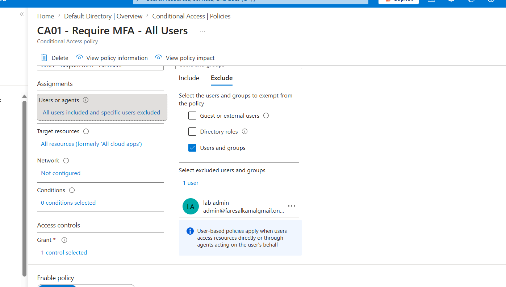
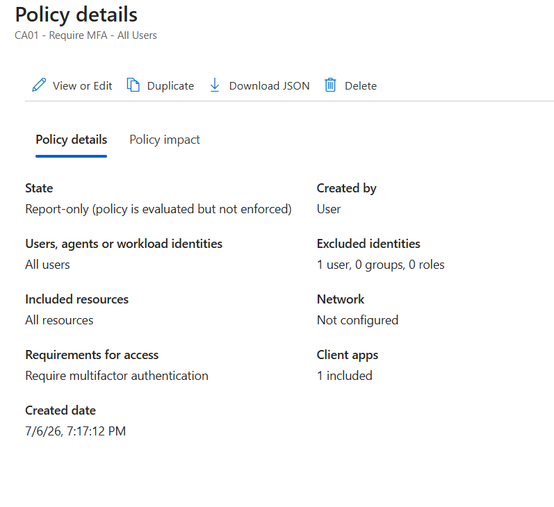
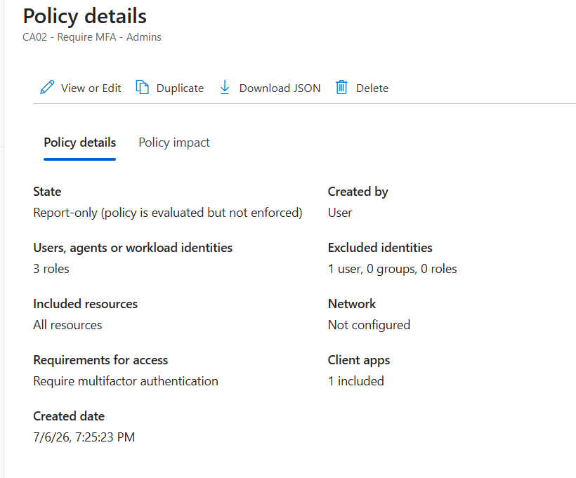
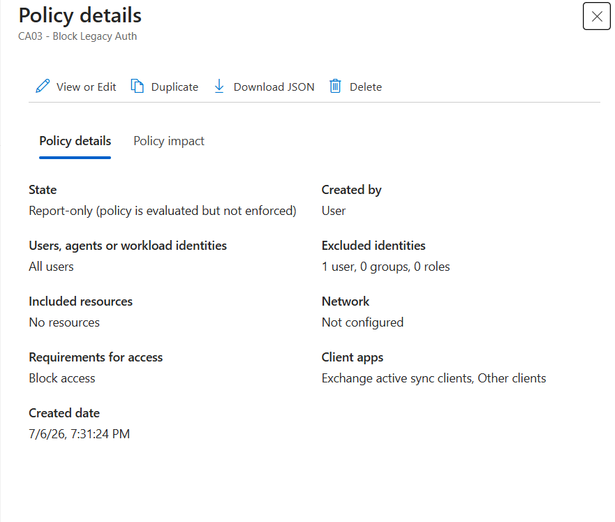
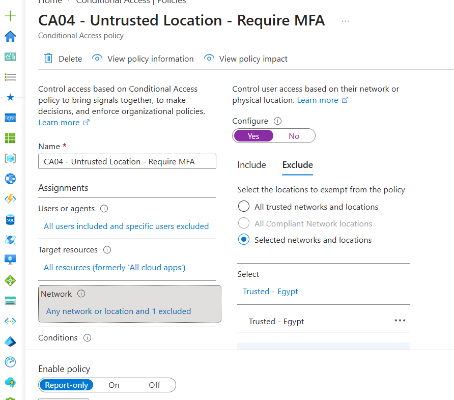
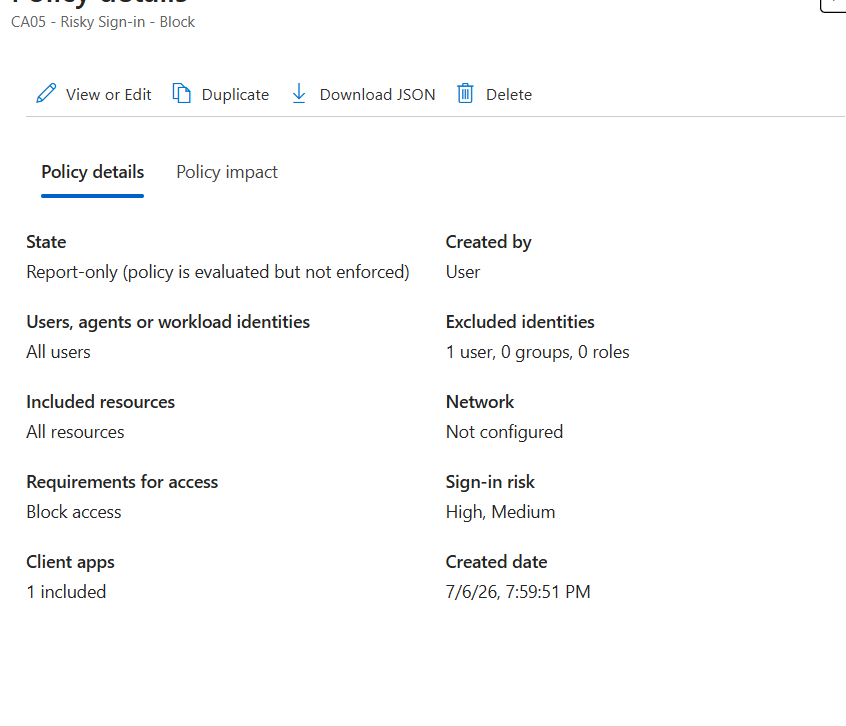
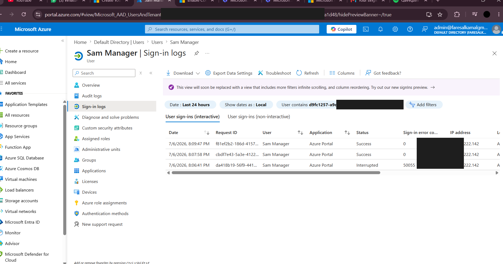

# 02 · MFA & Conditional Access

**Status:** ✅ Completed
**Zero Trust pillar:** Verify explicitly
**License required:** Entra ID P1 (Conditional Access) · P2 (risk-based policies)

---

## Objective

Make a password insufficient. Every sign-in must prove identity with a second factor and
satisfy contextual conditions — role, location, client type, and risk — before access is
granted.

---

## Prerequisite: disabling Security Defaults

Security Defaults (Microsoft's baseline all-or-nothing MFA) is enabled on new tenants and
**conflicts with Conditional Access** — the two cannot run together. Disabled at
`Entra ID → Overview → Properties → Manage security defaults`, selecting *"My organization is
using Conditional Access"*.

**Trade-off understood:** this trades a blunt, always-on control for a granular one. The
tenant is briefly less protected in exchange for policies that can distinguish an admin from
a contractor, and a trusted network from an anonymous proxy.

---

## Two rules applied to every policy

### 1. Report-only before enforcement

Every policy was created in **report-only**, which evaluates and logs the outcome without
enforcing it. Only after reviewing the logged impact was a policy switched to On.

**Why:** a Conditional Access policy runs on *every* sign-in. A misconfiguration doesn't
degrade access — it removes it, for everyone, instantly. Report-only makes the cost of a
mistake a log entry instead of an outage.

### 2. Break-glass exclusion

The `lab admin` account is **excluded from all five policies**.

**Why:** the classic self-inflicted incident is locking every administrator out of the tenant
with the very policy meant to protect it — including the administrator who would fix it. One
excluded account guarantees a way back in.

> **Known gap:** this deliberately creates a weaker-protected account. In production it
> requires alerting on every sign-in, hardware-token protection, and sealed split credentials.
> An unmonitored break-glass account is a backdoor.

---

## The policy set

| Policy | Include | Exclude | Condition | Control |
|---|---|---|---|---|
| `CA01 - Require MFA - All Users` | All users | lab admin | Any sign-in | Require MFA |
| `CA02 - Require MFA - Admins` | 3 directory roles | lab admin | Any sign-in | Require MFA |
| `CA03 - Block Legacy Auth` | All users | lab admin | Legacy auth clients | **Block** |
| `CA04 - Untrusted Location - Require MFA` | All users / any location | lab admin, `Trusted - Egypt` | Outside trusted location | Require MFA |
| `CA05 - Risky Sign-in - Block` | All users | lab admin | Sign-in risk **High + Medium** | **Block** |

### CA01 — baseline MFA

### CA02 — why a separate admin policy
`CA01` already covers everyone, so `CA02` is technically redundant — deliberately. It makes
intent explicit, survives any future narrowing of `CA01`, and reflects that admin accounts are
the highest-value target and warrant their own stated control.

### CA03 — blocking legacy authentication
Legacy protocols (IMAP/POP/SMTP basic auth, older Exchange ActiveSync) **cannot perform MFA**.
They authenticate with a password alone, which means they are a working MFA bypass for the
entire tenant. Blocking them is what makes `CA01` real rather than theoretical.

Note *"Included resources: No resources"* — correct, because this policy matches on the
**client app condition**, not on a resource.

### CA04 — location-aware access
A **Named Location** (`Trusted - Egypt`) was defined first, then the policy configured as
*include* **any location**, *exclude* the trusted location — i.e. challenge everywhere except
the known-good country.

**A mistake caught here:** the policy initially saved with scope "any location" because the
named location didn't exist yet, so the exclusion silently referenced nothing. The policy was
enforcing something other than what was intended. Corrected after verifying effective scope
post-save.

### CA05 — risk-based blocking (P2)
Uses **Identity Protection** to evaluate sign-in risk in real time — impossible travel, leaked
credentials, anonymous IP, unfamiliar sign-in properties. High and Medium risk are blocked.

This is the "assume breach" control in the authentication layer: it assumes credentials will
eventually be stolen and blocks the use that looks wrong.

---

## Verification — live proof of enforcement

`CA01` was switched from report-only to **On**, then tested by signing in as `Sam.Manager`
from a separate private session.

The sign-in logs record the full enforcement path:

| Time | Status | Error | Meaning |
|---|---|---|---|
| 8:06:41 PM | **Interrupted** | `50055` | Conditional Access interrupted the sign-in to demand MFA |
| 8:07:58 PM | **Success** | `0` | Access granted after authentication |
| 8:09:47 PM | **Success** | `0` | Subsequent authenticated access |

This is the difference between a policy that is *configured* and a policy that is *working*.

---

## A deliberate omission: the Insights dashboard

The Conditional Access **Insights and reporting** workbook returned **401 Unauthorized**.

**Root cause:** it is a Log Analytics–backed workbook. It doesn't read Conditional Access data
directly — it queries an Azure Monitor workspace that sign-in logs must first be streamed into
via diagnostic settings. No workspace existed, and the admin account lacked subscription-level
rights to reach one.

**Decision: skipped, deliberately.** Enabling it means provisioning a workspace, configuring
diagnostic settings, and paying for log ingestion. Since the workbook is an aggregate *view*
over data that raw sign-in logs already expose, I used the source instead. A log entry naming
the exact policy on a specific sign-in is more precise evidence than a summary chart — and it
costs nothing.

---

## Outcome

Five layered authentication controls, each built report-only and break-glass excluded, with
enforcement **verified against live sign-in telemetry** rather than assumed from configuration.

A stolen password in this tenant now yields: an MFA challenge, no legacy-protocol fallback, a
location check, and a risk evaluation.

---

## Lessons learned

**Security Defaults and Conditional Access are mutually exclusive.** You trade a blunt
instrument for a scalpel — and the tenant is unprotected in the gap between disabling one and
enabling the other.

**Blocking legacy auth is what makes MFA real.** An MFA policy with legacy protocols still
open is a policy with a documented bypass.

**Verify effective scope after saving.** `CA04` saved with a scope other than the one intended
because a referenced object didn't exist. Configuration intent and configuration reality are
different things.

**Error 50055 is the control working.** An "interrupted" sign-in is not a failure — it is the
policy doing exactly its job.

---

## Evidence

| Screenshot | Shows |
|---|---|
| `02-ca01-require-mfa-all-users.png` | CA01 — report-only, admin excluded |
| `02-ca01-breakglass-exclusion.png` | Break-glass account on Exclude tab |
| `02-ca02-require-mfa-admins.png` | CA02 — 3 directory roles targeted |
| `02-ca03-block-legacy-auth.png` | CA03 — ActiveSync + other clients blocked |
| `02-ca04-untrusted-location-config.png` | CA04 — any location, trusted excluded |
| `02-ca04-untrusted-location.png` | CA04 — policy summary |
| `02-ca05-risky-signin-block.png` | CA05 — High + Medium risk blocked |
| **`02-signin-logs-mfa-enforced.png`** | ⭐ Interrupted `50055` → MFA → Success |

---

## Production hardening

| Gap | Fix |
|---|---|
| Authenticator push is phishable | **FIDO2 / passkeys** via authentication strengths |
| No device signal | **Intune compliance** — require compliant/hybrid-joined device |
| Break-glass unmonitored | Alert on every break-glass sign-in |
| No session controls | Sign-in frequency + persistent browser restrictions |
| Manual log review | Stream sign-in logs to a **SIEM** with detections |
